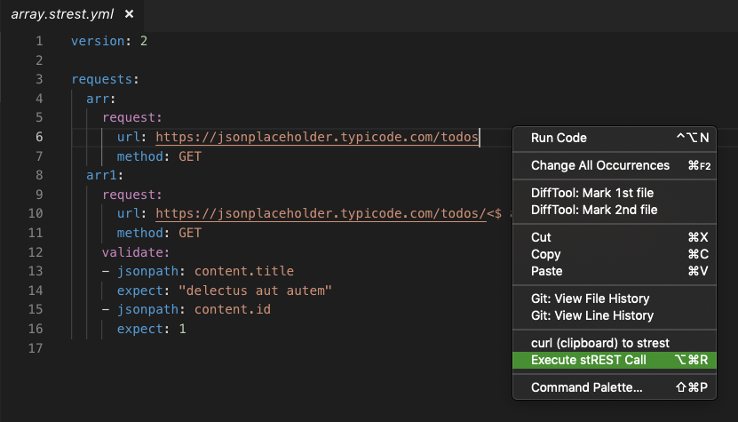
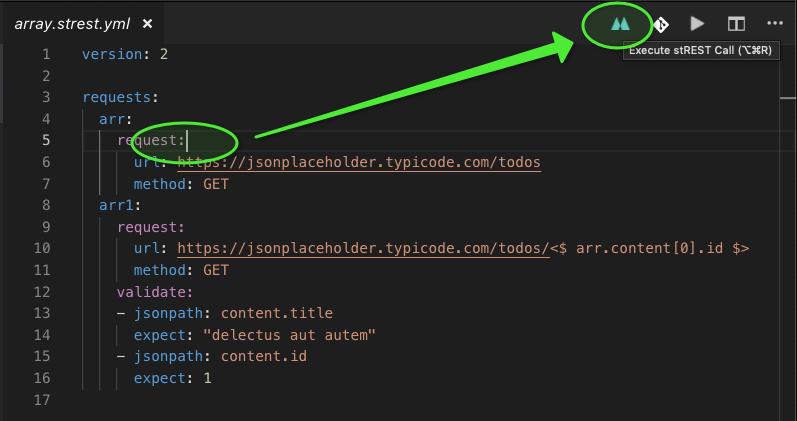
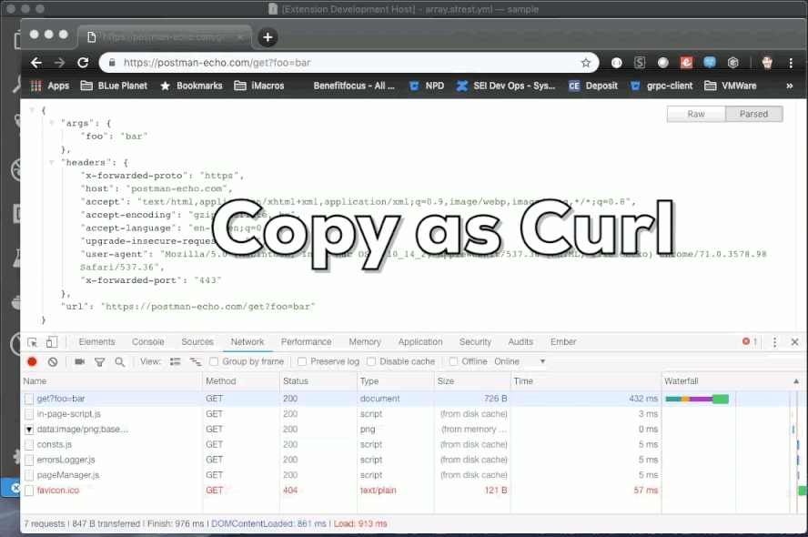

# stREST Client for VS Code

stREST Client allows you to send HTTP request specified in [stREST](https://github.com/eykrehbein/strest) and view the response in Visual Studio Code directly.

## Main Features

* Send __HTTP requests__ in editor and view response (strest_history.json) in a separate pane

Three ways to execute a test:

|   Execution   |                       detail                       |
| ------------- | -------------------------------------------------- |
| Right Click   |  |
| stREST Button |          |
| cmd-alt-r     | Mac keyboard Shortcut to execute Call              |
| ctrl-alt-r    | Windows keyboard Shortcut to execute Call          |
| Import Curl   |           |

## License

[MIT License](LICENSE)

## Change Log

See CHANGELOG [here](CHANGELOG.md)

## Feedback

Please provide feedback through the [GitHub Issue](https://github.com/jgroom33/vscode-strestclient/issues) system, or fork the repository and submit PR.

[market](https://marketplace.visualstudio.com/items?itemName=jgroom.ciena)
