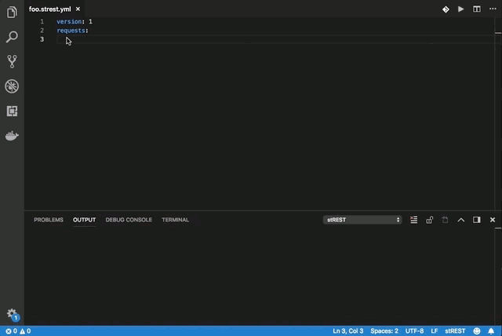

# stREST Client

stREST Client allows you to send HTTP request specified in [stREST](https://github.com/eykrehbein/strest) and view the response in Visual Studio Code directly.

## Main Features

* Send __HTTP requests__ in editor and view response (strest_history.json) in a separate pane

## License

[MIT License](LICENSE)

## Change Log

See CHANGELOG [here](CHANGELOG.md)

## Feedback

Please provide feedback through the [GitHub Issue](https://github.com/jgroom33/vscode-strestclient/issues) system, or fork the repository and submit PR.
